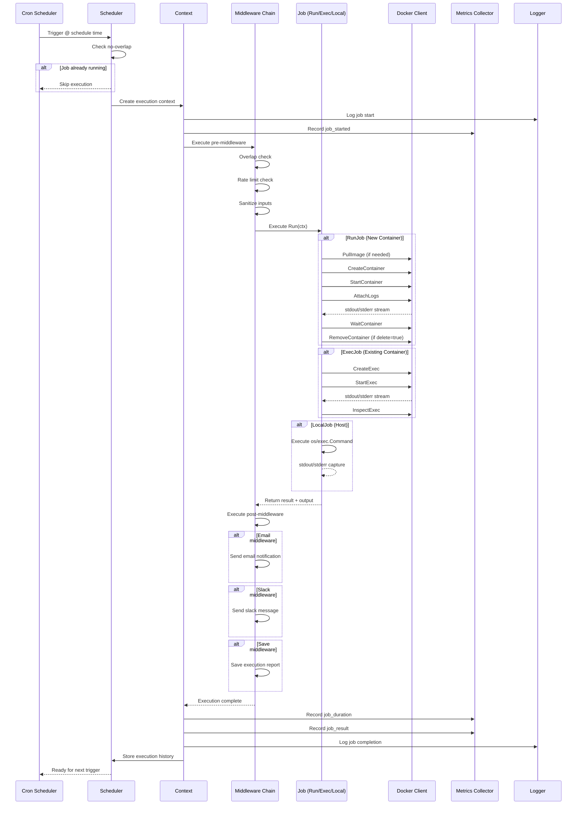
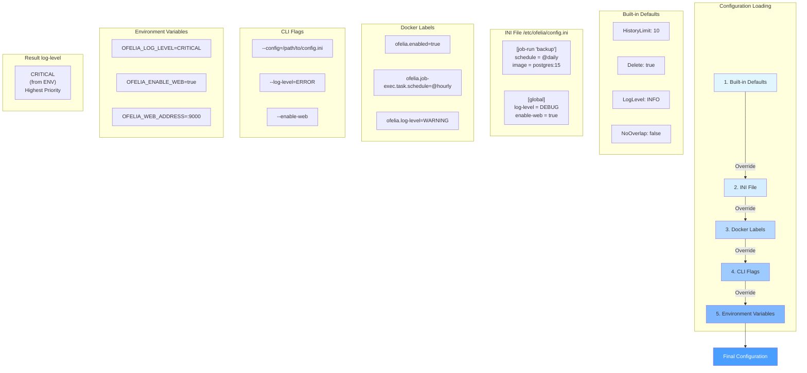
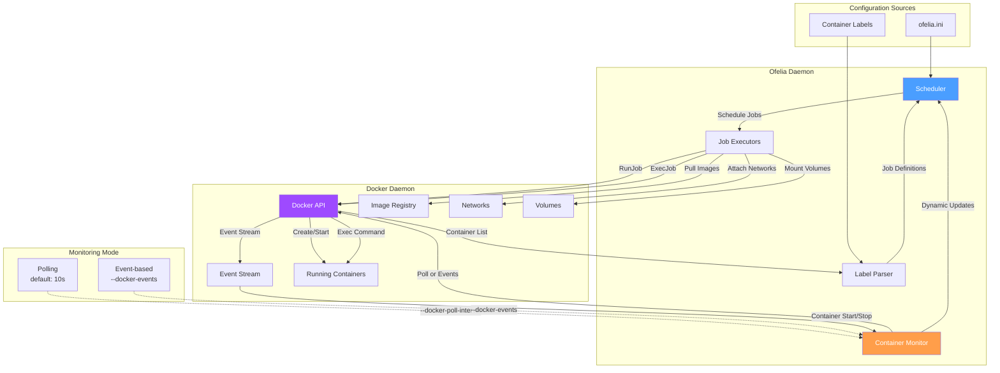
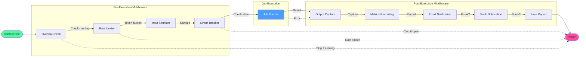
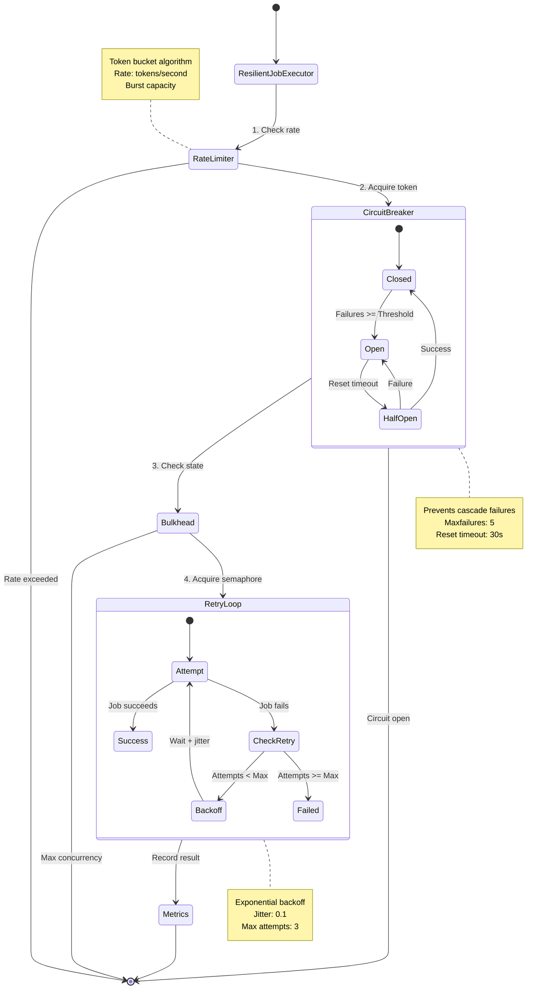
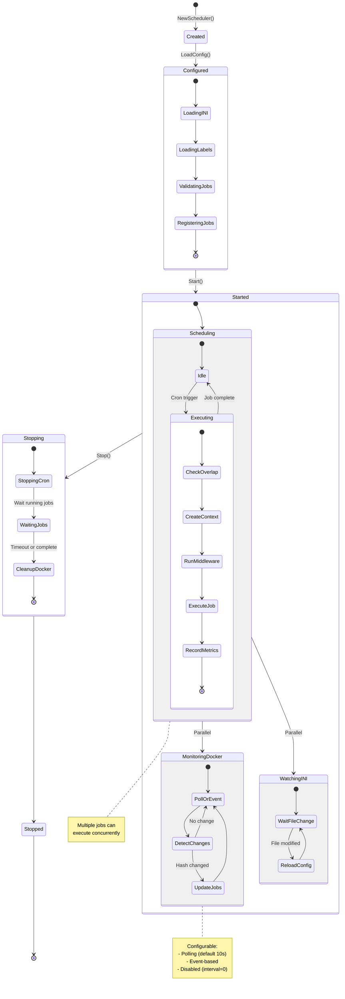
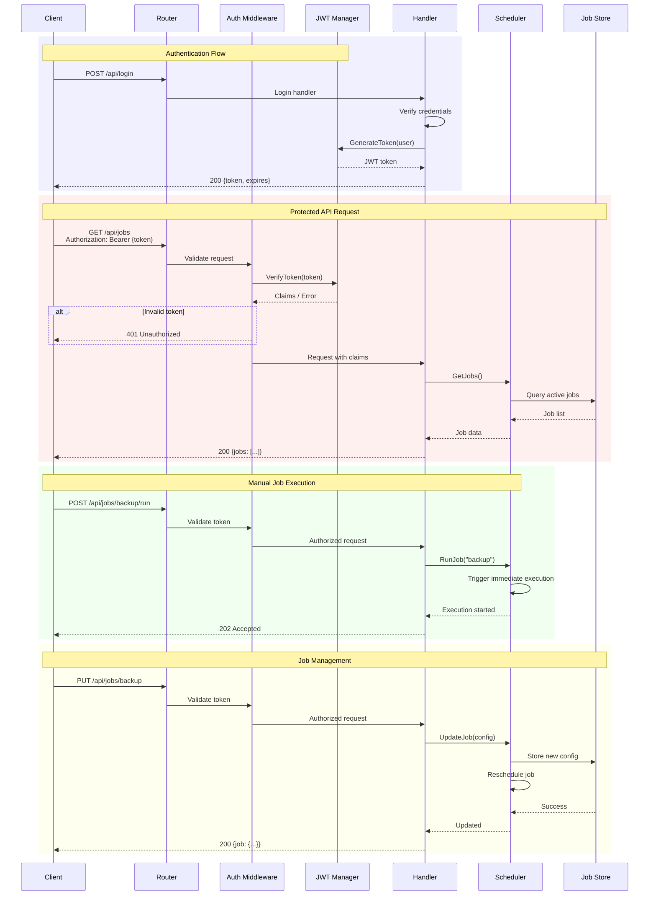
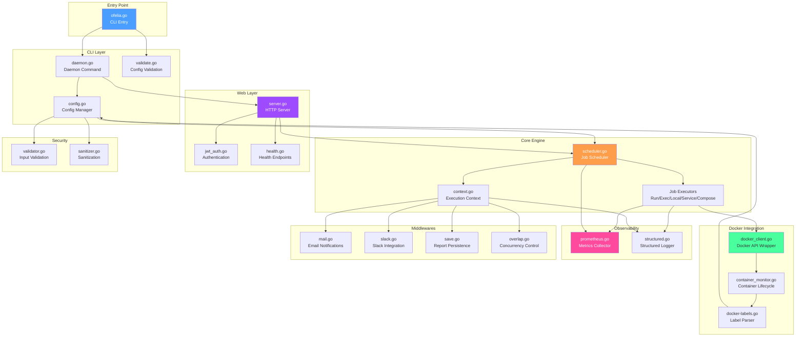

# Ofelia Architecture Diagrams

Comprehensive visual documentation of Ofelia's architecture, execution flows, and design patterns.

## Table of Contents
- [Job Execution Lifecycle](#job-execution-lifecycle)
- [Configuration Precedence](#configuration-precedence)
- [Docker Integration Architecture](#docker-integration-architecture)
- [Middleware Chain Execution](#middleware-chain-execution)
- [Resilience Patterns](#resilience-patterns)
- [Scheduler State Machine](#scheduler-state-machine)
- [Web UI & API Flow](#web-ui--api-flow)

---

## Job Execution Lifecycle

Complete lifecycle from schedule trigger to completion with all system interactions.

---

## Configuration Precedence

How Ofelia merges configuration from multiple sources (5-layer system).

---

## Docker Integration Architecture

How Ofelia interacts with Docker daemon and manages containers.

---

## Middleware Chain Execution

Middleware execution order and context propagation.

---

## Resilience Patterns

Comprehensive resilience implementation with circuit breaker, retry, rate limiting.

---

## Scheduler State Machine

Scheduler lifecycle and state transitions.

---

## Web UI & API Flow

HTTP request handling with JWT authentication and API endpoints.

---

## Component Interaction Map

High-level view of major component interactions.

---

## Cross-References

- [Project Index](./PROJECT_INDEX.md)
- [Architecture Overview](./architecture.md)
- [Core Package Documentation](./packages/core.md)
- [CLI Package Documentation](./packages/cli.md)
- [Web Package Documentation](./packages/web.md)
- [Configuration Guide](./CONFIGURATION.md)
- [Security Documentation](./SECURITY.md)

---

*Generated: 2025-11-21 | Visual documentation for Ofelia architecture patterns and execution flows*
