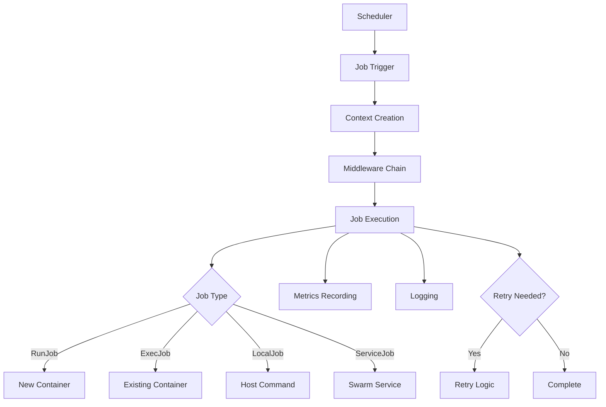

# Ofelia Project Documentation Index

## 🏗️ Project Overview

**Ofelia** is a modern, Go-powered job scheduler for Docker containers that provides a lightweight alternative to traditional cron with container orchestration capabilities.

### Key Capabilities
- **Container Job Scheduling**: Schedule tasks within running containers or spawn new ones
- **Multiple Job Types**: Support for RunJob, ExecJob, LocalJob, ServiceJob, and ComposeJob
- **Dynamic Docker Integration**: Auto-discover containers via labels or events
- **Resilient Execution**: Built-in retry logic, circuit breakers, and rate limiting
- **Comprehensive Monitoring**: Prometheus metrics, structured logging, and health checks
- **Web UI & API**: Interactive dashboard for job management and monitoring
- **Security-First Design**: Input validation, JWT authentication, and sanitization

## 📁 Project Structure

```
ofelia/
├── 📦 core/               # Core business logic and job execution
├── 🖥️ cli/                # Command-line interface and configuration
├── 🌐 web/                # Web UI and API endpoints
├── 📊 metrics/            # Prometheus metrics collection
├── 📝 logging/            # Structured logging system
├── ✅ config/             # Configuration validation and sanitization
├── 🔌 middlewares/        # Job execution middlewares (mail, slack, etc.)
├── 🧪 test/               # Test utilities and helpers
├── 📚 docs/               # Documentation
├── 🎨 static/             # Web UI static assets
└── 💼 example/            # Example configurations
```

## 🔧 Core Components

### 1. Job System (`core/`)

#### Job Types
- **[RunJob](../core/runjob.go)**: Execute commands in new containers
- **[ExecJob](../core/execjob.go)**: Execute commands in existing containers  
- **[LocalJob](../core/localjob.go)**: Execute commands on the host
- **[ServiceJob](../core/runservice.go)**: Run as Docker Swarm services
- **[ComposeJob](../core/composejob.go)**: Execute docker-compose operations

#### Core Infrastructure
- **[Scheduler](../core/scheduler.go)**: Cron-based job scheduling engine
- **[Context](../core/common.go)**: Execution context and middleware chain
- **[Docker Client](../core/docker_client.go)**: Docker API operations wrapper
- **[Container Monitor](../core/container_monitor.go)**: Container lifecycle tracking
- **[Resilience](../core/resilience.go)**: Retry policies, circuit breakers, rate limiting

### 2. Configuration (`cli/` & `config/`)

- **[Config Manager](../cli/config.go)**: INI/Docker labels configuration loading
- **[Validator](../config/validator.go)**: Configuration validation rules
- **[Sanitizer](../config/sanitizer.go)**: Input sanitization and security
- **[Docker Labels](../cli/docker-labels.go)**: Docker label-based configuration

### 3. Web Interface (`web/`)

- **[Server](../web/server.go)**: HTTP server and routing
- **[JWT Auth](../web/jwt_auth.go)**: JWT-based authentication
- **[Health Checks](../web/health.go)**: Liveness and readiness probes
- **[Middleware](../web/middleware.go)**: HTTP request processing

### 4. Monitoring (`metrics/` & `logging/`)

- **[Prometheus Metrics](../metrics/prometheus.go)**: Job and system metrics
- **[Structured Logging](../logging/structured.go)**: JSON/text logging with context
- **[Job Logger](../logging/structured.go#L291)**: Job-specific logging with metrics

### 5. Middlewares (`middlewares/`)

- **[Mail](../middlewares/mail.go)**: Email notifications
- **[Slack](../middlewares/slack.go)**: Slack integration
- **[Save](../middlewares/save.go)**: Output persistence
- **[Overlap](../middlewares/overlap.go)**: Overlap prevention
- **[Sanitize](../middlewares/sanitize.go)**: Output sanitization

## 🔄 Execution Flow



## 🛡️ Security Features

### Input Validation
- Command injection prevention
- Path traversal protection
- SQL/LDAP injection guards
- Docker image name validation
- Cron expression validation

### Authentication & Authorization
- JWT-based API authentication
- Secure token management
- Session handling
- CORS protection

### Resilience Patterns
- **Circuit Breakers**: Prevent cascade failures
- **Rate Limiting**: Token bucket algorithm
- **Retry Policies**: Exponential backoff with jitter
- **Bulkhead Pattern**: Resource isolation

## 📊 Metrics & Monitoring

### Available Metrics
```
ofelia_jobs_total              # Total jobs executed
ofelia_jobs_failed_total       # Failed job count
ofelia_jobs_running            # Currently running jobs
ofelia_job_duration_seconds    # Job execution duration histogram
ofelia_docker_operations_total # Docker API operations
ofelia_docker_errors_total     # Docker API errors
ofelia_http_requests_total     # HTTP request count
ofelia_circuit_breaker_*       # Circuit breaker states
```

### Health Endpoints
- `/health/liveness`: Service availability
- `/health/readiness`: Service readiness
- `/metrics`: Prometheus metrics endpoint

## 🔌 API Reference

### Job Management
- `GET /api/jobs`: List all jobs
- `GET /api/job/{name}`: Get job details
- `POST /api/job/{name}/run`: Trigger job execution
- `PUT /api/job/{name}`: Update job configuration
- `DELETE /api/job/{name}`: Remove job

### Authentication
- `POST /api/login`: Authenticate and receive JWT
- `POST /api/refresh`: Refresh JWT token
- `POST /api/logout`: Invalidate token

## 🚀 Configuration Examples

### INI Configuration
```ini
[job-local "backup"]
schedule = @daily
command = /usr/local/bin/backup.sh

[job-exec "db-maintenance"]
schedule = 0 2 * * *
container = postgres
command = vacuumdb --all --analyze

[job-run "report-generator"]
schedule = 0 */6 * * *
image = myapp/reporter:latest
command = generate-report --type=daily
```

### Docker Labels
```yaml
labels:
  ofelia.enabled: "true"
  ofelia.job-exec.db-backup.schedule: "@midnight"
  ofelia.job-exec.db-backup.command: "pg_dump -U postgres mydb"
```

## 🧪 Testing

### Test Coverage Areas
- Unit tests for all core components
- Integration tests for Docker operations
- End-to-end tests for job execution
- Benchmark tests for performance-critical paths

### Running Tests
```bash
go test ./...                    # Run all tests
go test -race ./...             # Run with race detector
go test -cover ./...            # Show coverage
go test -bench=. ./core         # Run benchmarks
```

## 📚 Package Documentation

### Core Packages
- [`core`](./packages/core.md): Job execution and scheduling
- [`cli`](./packages/cli.md): Configuration and CLI commands
- [`web`](./packages/web.md): HTTP server and API
- [`metrics`](./packages/metrics.md): Monitoring and observability
- [`logging`](./packages/logging.md): Structured logging
- [`config`](./packages/config.md): Validation and sanitization
- [`middlewares`](./packages/middlewares.md): Job execution plugins

## 🔗 Cross-References

### Configuration Flow
`cli/config.go` → `config/validator.go` → `config/sanitizer.go` → `core/scheduler.go`

### Job Execution Path
`core/scheduler.go` → `core/context.go` → `middlewares/*` → `core/*job.go`

### Docker Integration
`core/docker_client.go` ← `core/container_monitor.go` ← `core/runjob.go`

### Monitoring Pipeline
`core/resilient_job.go` → `metrics/prometheus.go` ← `web/server.go`

## 🔍 Quick Navigation

- [Getting Started](../README.md)
- [Configuration Guide](./CONFIGURATION.md)
- [API Documentation](./API.md)
- [Development Guide](./DEVELOPMENT.md)
- [Security Considerations](./SECURITY.md)
- [Troubleshooting](./TROUBLESHOOTING.md)

---
*Generated on: 2025-09-03 | Version: Latest*