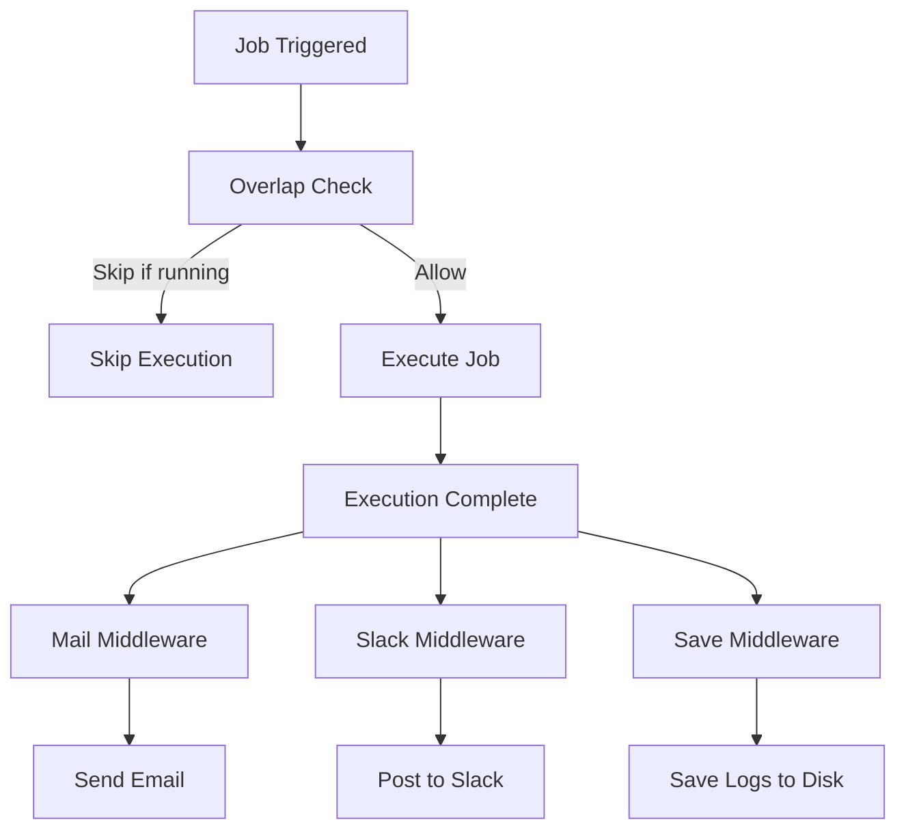

# Middlewares Package

**Package**: `middlewares`
**Path**: `/middlewares/`
**Purpose**: Job execution middlewares for notifications, output persistence, and overlap prevention

## Overview

The middlewares package provides a plugin architecture for extending job execution behavior. Middlewares wrap job execution to add features like email notifications, Slack alerts, output persistence, and concurrent execution prevention. All middlewares implement the `core.Middleware` interface and integrate seamlessly into the execution chain.

## Middleware Interface

```go
type Middleware interface {
    Run(ctx *Context) error
    ContinueOnStop() bool
}
```

- **Run**: Execute middleware logic and call `ctx.Next()` to continue chain
- **ContinueOnStop**: Return `true` to execute even when job is stopped/failed

## Available Middlewares

### 1. Mail

Email notification middleware with customizable SMTP configuration.

**Configuration**:
```go
type MailConfig struct {
    SMTPHost          string
    SMTPPort          int
    SMTPUser          string
    SMTPPassword      string
    SMTPTLSSkipVerify bool
    EmailTo           string
    EmailFrom         string
    MailOnlyOnError   *bool
}
```

**Features**:
- Sends email after job completion
- Includes stdout/stderr as attachments
- HTML formatted body with job details
- Optional error-only mode
- TLS/SSL support

**Usage**:
```ini
[job-exec "database-backup"]
schedule = @daily
container = postgres
command = pg_dump mydb
mail-only-on-error = true
email-to = admin@example.com
email-from = ofelia@example.com
smtp-host = smtp.gmail.com
smtp-port = 587
smtp-user = ofelia@example.com
smtp-password = secret
```

**Email Format**:
- **Subject**: `Ofelia executed: job_name [SUCCESS/FAILED]`
- **Body**: HTML template with execution details
- **Attachments**: `job_name_execution_id.stdout.log`, `*.stderr.log`

### 2. Slack

Slack webhook integration for job notifications.

**Configuration**:
```go
type SlackConfig struct {
    SlackWebhook     string
    SlackOnlyOnError *bool
}
```

**Features**:
- Posts messages to Slack channels via webhooks
- Color-coded messages (green=success, red=failure)
- Includes job name, status, duration, output
- Optional error-only mode
- Custom username and avatar

**Usage**:
```ini
[job-run "report-generator"]
schedule = 0 9 * * *
image = myapp/reporter:latest
command = generate-report
slack-webhook = https://hooks.slack.com/services/YOUR/WEBHOOK/URL
slack-only-on-error = false
```

**Slack Message Format**:
```json
{
  "username": "Ofelia",
  "icon_url": "https://raw.githubusercontent.com/netresearch/ofelia/master/static/avatar.png",
  "attachments": [{
    "color": "good",
    "title": "Job: backup-db",
    "text": "Execution completed successfully",
    "fields": [
      {"title": "Duration", "value": "45.2s"},
      {"title": "Exit Code", "value": "0"}
    ]
  }]
}
```

### 3. Save

Output persistence middleware for saving execution logs to disk.

**Configuration**:
```go
type SaveConfig struct {
    SaveFolder      string
    SaveOnlyOnError *bool
}
```

**Features**:
- Saves stdout/stderr to disk after execution
- Creates timestamped log files
- Optional error-only mode
- Path sanitization for security
- JSON metadata file with execution details

**Usage**:
```ini
[job-local "system-backup"]
schedule = @daily
command = /backup/backup.sh
save-folder = /var/log/ofelia
save-only-on-error = false
```

**Output Files**:
```
/var/log/ofelia/
├── 20250115_093045_backup-db.stdout.log
├── 20250115_093045_backup-db.stderr.log
└── 20250115_093045_backup-db.json
```

**Metadata JSON**:
```json
{
  "job": "backup-db",
  "date": "2025-01-15T09:30:45Z",
  "duration": 45.2,
  "exitCode": 0,
  "failed": false,
  "user": "root"
}
```

### 4. Overlap

Prevents concurrent execution of the same job.

**Configuration**:
```go
type OverlapConfig struct {
    NoOverlap bool
}
```

**Features**:
- Skips execution if job is already running
- Per-job overlap detection
- Logs skipped executions
- No performance impact on non-overlapping jobs

**Usage**:
```ini
[job-exec "long-running-task"]
schedule = */5 * * * *
container = worker
command = process-queue
no-overlap = true
```

**Behavior**:
```
Time  Action
09:00 Job starts (allowed)
09:03 Job still running, new trigger arrives (skipped)
09:05 Job still running, new trigger arrives (skipped)
09:07 Job completes
09:10 New trigger arrives (allowed)
```

### 5. Sanitize

Path and filename sanitization utilities (used internally by Save middleware).

**Features**:
- Path traversal prevention (`..`, `~`)
- Null byte injection protection
- Windows reserved name handling
- Filename length limiting (255 chars)
- Special character replacement

**API**:
```go
type PathSanitizer struct {
    dangerousPatterns []*regexp.Regexp
    replacer          *strings.Replacer
}

// Sanitize path to prevent directory traversal
func (ps *PathSanitizer) SanitizePath(path string) string

// Sanitize filename for safe file system operations
func (ps *PathSanitizer) SanitizeFilename(filename string) string

// Validate save folder path
func (ps *PathSanitizer) ValidateSaveFolder(path string) error
```

**Examples**:
```go
sanitizer := NewPathSanitizer()

// Path traversal prevention
sanitizer.SanitizePath("../../etc/passwd") // → "etc_passwd"

// Filename sanitization
sanitizer.SanitizeFilename("job:name/test.log") // → "job_name_test.log"

// Job name sanitization
SanitizeJobName("backup/db") // → "backup_db"
```

## Middleware Execution Flow



## Configuration Examples

### Combined Middlewares

```ini
[job-exec "critical-backup"]
schedule = 0 2 * * *
container = postgres
command = pg_dump --all

# Prevent overlapping executions
no-overlap = true

# Save all executions
save-folder = /var/log/ofelia
save-only-on-error = false

# Email on errors only
mail-only-on-error = true
email-to = ops@example.com
email-from = ofelia@example.com
smtp-host = smtp.gmail.com
smtp-port = 587
smtp-user = ofelia@example.com
smtp-password = ${SMTP_PASSWORD}

# Slack for all executions
slack-webhook = ${SLACK_WEBHOOK}
slack-only-on-error = false
```

### Docker Labels Configuration

```yaml
services:
  database:
    image: postgres:13
    labels:
      ofelia.enabled: "true"
      ofelia.job-exec.db-backup.schedule: "@daily"
      ofelia.job-exec.db-backup.command: "pg_dump mydb"
      ofelia.job-exec.db-backup.no-overlap: "true"
      ofelia.job-exec.db-backup.save-folder: "/backup/logs"
      ofelia.job-exec.db-backup.email-to: "dba@example.com"
```

## Custom Middleware Development

### Creating Custom Middleware

```go
package middlewares

import "github.com/netresearch/ofelia/core"

// CustomConfig configuration for custom middleware
type CustomConfig struct {
    Enabled bool
    Option  string
}

// NewCustom creates a new custom middleware
func NewCustom(c *CustomConfig) core.Middleware {
    if !IsEmpty(c) {
        return &Custom{*c}
    }
    return nil
}

// Custom middleware implementation
type Custom struct {
    CustomConfig
}

// ContinueOnStop controls execution on job failure
func (m *Custom) ContinueOnStop() bool {
    return true // Execute even on failure
}

// Run executes the middleware logic
func (m *Custom) Run(ctx *core.Context) error {
    // Before job execution
    ctx.Logger.Info("Custom middleware: before execution")

    // Execute job
    err := ctx.Next()

    // After job execution
    ctx.Logger.Infof("Custom middleware: after execution (error: %v)", err)

    // Optional: Stop execution to record metrics
    ctx.Stop(err)

    return err
}
```

### Middleware Best Practices

1. **Always call `ctx.Next()`**: Required to continue middleware chain
2. **Handle errors gracefully**: Log errors, don't crash on middleware failures
3. **Use `ContinueOnStop()` wisely**: Return `true` for notifications, `false` for pre-execution checks
4. **Call `ctx.Stop(err)`**: Mark execution complete for metrics/status
5. **Sanitize user input**: Use path sanitization for file operations
6. **Respect `*-only-on-error`**: Allow users to reduce notification noise
7. **Add timeout handling**: Don't block job execution indefinitely

## Integration Points

### Core Integration
- **[Context](../../core/common.go)**: Middleware execution chain
- **[Scheduler](../../core/scheduler.go)**: Middleware registration and initialization
- **[Job](../../core/job.go)**: Job execution lifecycle

### Configuration Integration
- **[Config](../../cli/config.go)**: INI and label parsing
- **[Validator](../../config/validator.go)**: Configuration validation

### Logging Integration
- **[Logger](./logging.md)**: Contextual logging from middlewares

## Security Considerations

### Path Sanitization
All file paths are sanitized to prevent:
- Directory traversal (`../`, `~`)
- Null byte injection (`\x00`)
- Absolute path injection (`/etc/passwd`)
- Windows reserved names (`CON`, `PRN`, `AUX`)

### Email Security
- SMTP credentials never logged
- TLS/SSL supported for transport security
- Email addresses validated before sending

### Slack Security
- Webhook URLs never logged
- Input sanitized before JSON encoding
- Timeout protection (5s max)

## Performance Considerations

- **Mail**: ~100-500ms (SMTP connection overhead)
- **Slack**: ~50-200ms (HTTP POST with timeout)
- **Save**: ~10-50ms (disk I/O, depends on output size)
- **Overlap**: <1ms (in-memory check)
- **Sanitize**: <1ms (regex + string operations)

**Optimization Tips**:
- Use `*-only-on-error` for high-frequency jobs
- Configure appropriate timeouts for external services
- Ensure save folders are on fast storage
- Consider async processing for heavy middlewares

## Testing

```go
import (
    "testing"
    "github.com/netresearch/ofelia/middlewares"
    "github.com/netresearch/ofelia/core"
)

func TestSaveMiddleware(t *testing.T) {
    config := &middlewares.SaveConfig{
        SaveFolder:      t.TempDir(),
        SaveOnlyOnError: middlewares.BoolPtr(false),
    }

    middleware := middlewares.NewSave(config)

    ctx := &core.Context{
        Execution: &core.Execution{
            OutputStream: bytes.NewBufferString("test output"),
            ErrorStream:  bytes.NewBufferString(""),
        },
        Job: mockJob{name: "test-job"},
    }

    err := middleware.Run(ctx)
    if err != nil {
        t.Errorf("Save middleware failed: %v", err)
    }

    // Verify files created
    // ... test implementation
}
```

## Troubleshooting

### Mail Issues
```
Error: "Mail error: dial tcp: lookup smtp.gmail.com: no such host"
Solution: Check network connectivity and DNS resolution
```

```
Error: "535 Authentication failed"
Solution: Verify SMTP credentials and enable "Less secure apps" for Gmail
```

### Slack Issues
```
Error: "Slack webhook URL is invalid"
Solution: Ensure webhook URL includes scheme (https://) and valid host
```

```
Error: "Post request timeout"
Solution: Check network connectivity and increase timeout if needed
```

### Save Issues
```
Error: "invalid save folder: path traversal detected"
Solution: Use absolute path without .. or ~ components
```

```
Error: "permission denied"
Solution: Ensure Ofelia process has write permissions to save folder
```

## Related Documentation

- [Core Package](./core.md) - Job execution and middleware chain
- [Configuration Guide](../CONFIGURATION.md) - Middleware configuration
- [Security Considerations](../SECURITY.md) - Security best practices
- [PROJECT_INDEX](../PROJECT_INDEX.md) - Overall system architecture
