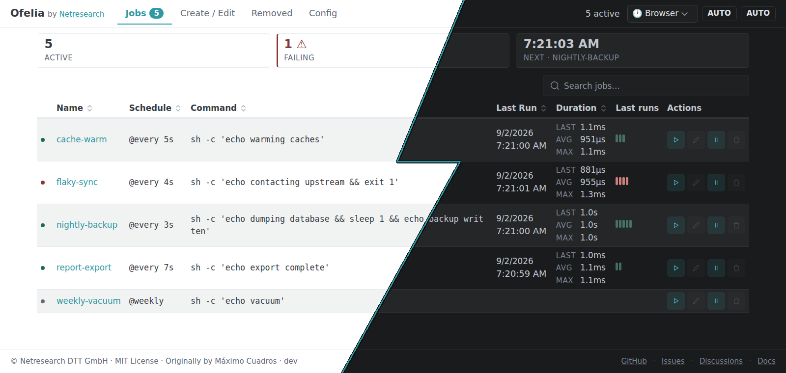

# Web Package

**Package**: `web`
**Path**: `/web/`
**Purpose**: HTTP server, API endpoints, token authentication, and health monitoring

## Overview

The web package provides a comprehensive HTTP interface for Ofelia, including RESTful API endpoints, token authentication, health checks, and security middleware. It exposes job management functionality through a web UI and API, with built-in rate limiting, cross-origin protection, and secure authentication.



The page is rendered server-side from the `html/template` partials in `static/ui/templates/`; the theme follows the system color scheme unless the header control overrides it.

## Key Components

### 1. Server

HTTP server with RESTful API for job management and monitoring.

```go
type Server struct {
    addr      string
    scheduler *core.Scheduler
    config    interface{}
    srv       *http.Server
    origins   map[string]string
    client    *dockerclient.Client
}
```

**Features**:
- RESTful API for job management
- Web UI with embedded static files
- Security middleware integration
- Rate limiting per IP (100 req/min)
- Graceful shutdown support
- Health check endpoints

**Creation**:
```go
server := web.NewServer(":8080", scheduler, config, dockerClient)
```

### 2. Authentication System

Authentication is optional (`web-auth-enabled`). A session is an opaque 256-bit random token that the server keeps in memory together with the user name and expiry. Tokens carry no claims and are not signed, so they end when the daemon restarts, and logout revokes them at once.

#### Secure Authentication

Enhanced authentication with bcrypt, rate limiting, and CSRF protection.

```go
type SecureAuthConfig struct {
    Enabled      bool
    Username     string
    PasswordHash string // bcrypt hash
    SecretKey    string // accepted, currently unused
    TokenExpiry  int    // hours
    MaxAttempts  int    // per minute
    TrustedProxies []string
}
```

**Features**:
- Bcrypt password hashing (cost 12)
- Constant-time username comparison
- Login rate limiting per client IP; idle buckets are evicted every minute
- Single-use CSRF token on the login, valid for 10 minutes; at most 10,000 outstanding, the oldest is evicted first
- Login body capped at 4 KiB (413), every other body at 1 MiB
- Timing attack prevention
- Secure HTTP-only, SameSite=Strict cookies; token responses carry `Cache-Control: no-store`

**Password Hashing**:
```go
// Generate bcrypt hash (cost 12)
hash, err := web.HashPassword("mySecurePassword")

// Store hash in config
config.PasswordHash = hash
```

**Rate Limiting**:
```go
// Create rate limiter: 5 attempts per minute
rateLimiter := web.NewRateLimiter(5, 5)

// Check if allowed
if !rateLimiter.Allow(clientIP) {
    return errors.New("too many attempts")
}
```

**CSRF Protection**:
```go
// Generate CSRF token
csrfToken, err := tokenManager.GenerateCSRFToken()

// Validate CSRF token (one-time use)
valid := tokenManager.ValidateCSRFToken(token)
```

### 3. Health Checks

Comprehensive health monitoring with Docker, scheduler, and system checks.

```go
type HealthChecker struct {
    startTime     time.Time
    dockerClient  *docker.Client
    version       string
    checks        map[string]HealthCheck
    checkInterval time.Duration // default: 30s
}
```

**Health Status Levels**:
```go
const (
    HealthStatusHealthy   = "healthy"
    HealthStatusDegraded  = "degraded"
    HealthStatusUnhealthy = "unhealthy"
)
```

**Checks Performed**:
1. **Docker Connectivity**: Ping Docker daemon, get container count
2. **Scheduler Status**: `healthy` while every configured job is scheduled.
   `degraded` — naming each one — as soon as the scheduler refuses a job, since
   an unparsable schedule or a duplicate name means that job never fires. A
   checker constructed without a scheduler is also `degraded`, rather than
   claiming health it cannot establish.
3. **System Resources**: Monitor memory usage (healthy <75%, degraded <90%, unhealthy ≥90%)

**Usage**:
```go
// Create health checker. The scheduler may be nil, at the cost of the check
// above; the version is what /health reports.
healthChecker := web.NewHealthChecker(dockerClient, scheduler, cli.Version)

// Register health endpoints
server.RegisterHealthEndpoints(healthChecker)

// The constructor starts a background loop that re-runs every check every 30s.
// Stop ends it; the daemon calls this from a shutdown hook. Safe to call more
// than once.
defer healthChecker.Stop()

// Health endpoints available:
// GET /health     - Detailed health information (always 200 OK)
// GET /healthz    - Simple health check alias
// GET /ready      - Readiness check (503 if unhealthy)
// GET /live       - Liveness check (always 200 OK)
```

**Health Response**:
```json
{
  "status": "healthy",
  "timestamp": "2025-01-15T10:30:00Z",
  "uptimeSeconds": 3600.5,
  "version": "v0.28.1",
  "checks": {
    "docker": {
      "name": "docker",
      "status": "healthy",
      "message": "Docker 24.0.7 running with 5 containers",
      "lastChecked": "2025-01-15T10:30:00Z",
      "durationMs": 8332586
    },
    "scheduler": {
      "name": "scheduler",
      "status": "healthy",
      "message": "Scheduler is operational",
      "lastChecked": "2025-01-15T10:30:00Z",
      "durationMs": 3180
    },
    "system": {
      "name": "system",
      "status": "healthy",
      "message": "System resources normal",
      "lastChecked": "2025-01-15T10:30:00Z",
      "durationMs": 2
    }
  },
  "system": {
    "goVersion": "go1.23.5",
    "goroutines": 12,
    "cpus": 8,
    "memoryAllocBytes": 45678900,
    "memoryTotalBytes": 67890123,
    "gcRuns": 45
  }
}
```

### 4. Security Middleware

HTTP middleware for security headers and rate limiting.

**Security Headers**:
```go
func securityHeaders(next http.Handler) http.Handler
```

**Headers Applied**:
- `X-Content-Type-Options: nosniff` - Prevent MIME sniffing
- `X-Frame-Options: DENY` - Prevent clickjacking
- `X-XSS-Protection: 1; mode=block` - XSS protection
- `Referrer-Policy: strict-origin-when-cross-origin` - Referrer control
- `Content-Security-Policy` - CSP for XSS prevention
- `Strict-Transport-Security` - HSTS (when using HTTPS)

**Rate Limiting**:
```go
type rateLimiter struct {
    requests map[string][]time.Time
    limit    int           // requests allowed
    window   time.Duration // time window
}

// Default: 100 requests per minute per IP
rl := newRateLimiter(100, time.Minute)
```

**Features**:
- Per-IP rate limiting
- Sliding window algorithm
- Automatic cleanup of old entries
- X-Forwarded-For support (honored only from trusted proxies, read from the right: the client is the rightmost entry that is not a trusted proxy)
- Counts every request, static assets included. Only the orchestrator probes
  (`/ready`, `/live`) are exempt, so a probe is never answered with 429.
  `/health` and `/healthz` are token-free but counted: `GetHealth` calls
  `runtime.ReadMemStats` on every request (stop-the-world) and reports the
  version and goroutine count

**Response Compression**:

Responses are compressed for clients that advertise a supported codec, via
`klauspost/compress/gzhttp` as the innermost middleware. The wrapper enables
**zstd** alongside gzip and prefers zstd at equal q-values, so Chrome, Edge and
Firefox — which send `Accept-Encoding: gzip, deflate, br, zstd` — receive
`Content-Encoding: zstd`, while clients that advertise gzip but not zstd receive
gzip. Clients advertising neither get identity responses. Responses below
gzhttp's 1 KiB threshold are not compressed at all. A handler that calls
`WriteHeader` before its first body
write must set `Content-Type` explicitly: the wrapper can only sniff a missing
type on the first write, and that sniff would otherwise run on the compressed
bytes.

### 5. API Endpoints

#### Job Management

| Endpoint | Method | Description |
|----------|--------|-------------|
| `/api/jobs` | GET | List all active jobs |
| `/api/jobs/removed` | GET | List removed jobs |
| `/api/jobs/disabled` | GET | List disabled jobs |
| `/api/jobs/run` | POST | Trigger job execution |
| `/api/jobs/disable` | POST | Disable a job |
| `/api/jobs/enable` | POST | Enable a job |
| `/api/jobs/create` | POST | Create new job (403 for INI/label-owned names) |
| `/api/jobs/update` | POST | Update job configuration (403 for INI/label-owned jobs) |
| `/api/jobs/delete` | POST | Delete a job (403 for INI/label-owned jobs) |
| `/api/jobs/{name}/history` | GET | Get job execution history |
| `/api/config` | GET | Get server configuration (jobs stripped) |
| `/api/dashboard` | GET | Aggregate of jobs, disabled, removed and config in one response; `?history=<job>` adds the runs of that job |

All three mutating endpoints refuse jobs whose source is the INI file or a
Docker label: they are changed at their source, and `POST /api/jobs/disable`
suppresses one without editing it. Create is gated on the *name*, not on a
registered job — a config job with an empty or malformed schedule holds no cron
entry, so nothing else would have stopped a create from taking its name.

The history that rides along on `?history=<job>` is elided once the client
already has it. Each response carrying history also carries
`historyFingerprint`; passing it back as `&historyFp=<value>` on the next poll
omits `history` from the response when it still matches. Clients that do not
send the parameter always receive the full history.

#### Job API Types

**Job Response**:
```go
type apiJob struct {
    Name     string          `json:"name"`
    Type     string          `json:"type"`     // "run", "exec", "local", "service", "compose"
    Schedule string          `json:"schedule"`
    Command  string          `json:"command"`
    Running  bool            `json:"running"`
    LastRun  *apiExecution   `json:"lastRun,omitempty"`
    NextRuns []time.Time     `json:"nextRuns"`
    PrevRuns []time.Time     `json:"prevRuns"`
    Origin   string          `json:"origin"`   // "ini", "label", "api", "web"
    Config   json.RawMessage `json:"config"`
    // Outcome summary of the newest runs (oldest first, at most 10), so
    // list views can draw a sparkline without fetching each job's
    // history. Omitted on /api/jobs/removed, where nothing reads it.
    RecentRuns []apiRecentRun `json:"recentRuns,omitempty"`
}

type apiRecentRun struct {
    Date     time.Time     `json:"date"`
    Duration time.Duration `json:"duration"`
    Failed   bool          `json:"failed"`
    Skipped  bool          `json:"skipped"`
}
```

**Execution Response**:
```go
type apiExecution struct {
    Date     time.Time     `json:"date"`
    Duration time.Duration `json:"duration"`
    Failed   bool          `json:"failed"`
    Skipped  bool          `json:"skipped"`
    Error    string        `json:"error,omitempty"`
    Stdout   string        `json:"stdout"`
    Stderr   string        `json:"stderr"`
}
```

## API Usage Examples

### List All Jobs

```bash
GET /api/jobs
```

**Response**:
```json
[
  {
    "name": "backup-db",
    "type": "exec",
    "schedule": "@daily",
    "command": "pg_dump mydb",
    "lastRun": {
      "date": "2025-01-15T02:00:00Z",
      "duration": 45200000000,
      "failed": false,
      "skipped": false,
      "stdout": "Backup completed successfully",
      "stderr": ""
    },
    "origin": "config"
  }
]
```

### Run Job Manually

```bash
POST /api/jobs/run
Content-Type: application/json

{
  "name": "backup-db"
}
```

**Response**: `204 No Content` on success

### Create New Job

```bash
POST /api/jobs/create
Content-Type: application/json

{
  "name": "new-job",
  "type": "local",
  "schedule": "0 */6 * * *",
  "command": "/backup/script.sh"
}
```

**Response**: `201 Created` on success

### Get Job History

```bash
GET /api/jobs/backup-db/history
```

**Response**:
```json
[
  {
    "date": "2025-01-15T02:00:00Z",
    "duration": 45200000000,
    "failed": false,
    "skipped": false,
    "stdout": "Backup completed",
    "stderr": ""
  },
  {
    "date": "2025-01-14T02:00:00Z",
    "duration": 43100000000,
    "failed": false,
    "skipped": false,
    "stdout": "Backup completed",
    "stderr": ""
  }
]
```

## Authentication Flow

### Login with CSRF token

```bash
# 1. Fetch a single-use CSRF token
GET /api/csrf-token

# Response:
{"csrf_token": "abc123..."}

# 2. Log in with it
POST /api/login
Content-Type: application/json
X-CSRF-Token: abc123...

{
  "username": "admin",
  "password": "secure123"
}

# Response:
{
  "token": "auth_token_here",
  "csrf_token": "new_csrf_token",
  "expires_in": 86400
}

# Cookie set: auth_token (HttpOnly, SameSite=Strict; Secure over HTTPS)

# 3. Use the token or the cookie
GET /api/jobs
Authorization: Bearer auth_token_here
```

State-changing requests (POST and the like) that a browser sends from another origin are rejected with 403 by `http.CrossOriginProtection`, with and without authentication. Clients that send no `Sec-Fetch-Site` or `Origin` header, such as `curl`, are not affected.

## Server Configuration

### Basic Setup

```go
import (
    "github.com/netresearch/ofelia/web"
    "github.com/netresearch/ofelia/core"
)

func main() {
    // Create scheduler
    scheduler := core.NewScheduler()

    // Create server
    server := web.NewServer(":8080", scheduler, config, dockerClient)

    // Create health checker
    healthChecker := web.NewHealthChecker(dockerClient, scheduler, cli.Version)
    defer healthChecker.Stop()
    server.RegisterHealthEndpoints(healthChecker)

    // Start server
    if err := server.Start(); err != nil {
        log.Fatal(err)
    }

    // Graceful shutdown
    <-ctx.Done()
    shutdownCtx, cancel := context.WithTimeout(context.Background(), 30*time.Second)
    defer cancel()

    if err := server.Shutdown(shutdownCtx); err != nil {
        log.Printf("Server shutdown error: %v", err)
    }
}
```

### With Secure Authentication

```go
// NewServerWithAuth wires the token manager, the login rate limiter and its
// eviction loop, the login/logout/auth-status/csrf-token routes and the auth
// middleware from one config.
authConfig := &web.SecureAuthConfig{
    Enabled:      true,
    Username:     "admin",
    PasswordHash: hashedPassword, // bcrypt hash
    TokenExpiry:  24,
    MaxAttempts:  5,
    TrustedProxies: []string{"172.17.0.0/16"}, // only behind a reverse proxy
}

server := web.NewServerWithAuth(":8080", scheduler, config, dockerProvider, authConfig)
```

## Security Considerations

### Password Security

- **Bcrypt hashing**: Cost factor 12 for security/performance balance
- **Constant-time comparison**: Prevents timing attacks on username
- **Rate limiting**: Prevent brute force (default: 5 attempts/minute)
- **Delay on failure**: 100ms delay to slow brute force

### Token Security

- **Session tokens**: 256-bit random values held in memory; not signed, so `web-secret-key` has no effect and sessions end on restart
- **Token expiry**: Configurable (default: 24 hours)
- **CSRF token**: single-use, required by the login, valid for 10 minutes
- **Cross-origin protection**: state-changing browser requests from another origin get 403, with and without authentication
- **Secure cookies**: HttpOnly, Secure (HTTPS), SameSite=Strict

### Network Security

- **HTTPS enforcement**: HSTS header when TLS detected
- **Security headers**: XSS protection, frame denial, CSP
- **Rate limiting**: 100 requests/minute per IP (configurable)
- **Request timeouts**: ReadHeader 5s, Read 30s, Write 60s, Idle 120s
- **Request body limits**: 1 MiB per request, 4 KiB for the login

### Input Validation

- **Method validation**: Enforce POST for state changes
- **Content-type checks**: Validate JSON payloads
- **Origin tracking**: Track job creation source (config, docker, API)

## Performance Considerations

### Server Timeouts

```go
server.srv = &http.Server{
    Addr:              ":8080",
    ReadHeaderTimeout: 5 * time.Second,  // Prevent slow header attacks
    WriteTimeout:      60 * time.Second, // Long-running jobs need time
    IdleTimeout:       120 * time.Second, // Keep-alive timeout
}
```

### Rate Limiting

- **Default**: 100 requests/minute per IP
- **Cleanup**: Periodic cleanup every window duration
- **Memory**: O(n) where n = unique IPs in window

### Health Checks

- **Interval**: 30 seconds (configurable)
- **Overhead**: <15ms per check cycle
- **Docker ping**: ~10ms
- **System stats**: ~2ms

## Integration Points

### Core Integration

- **[Scheduler](../../core/scheduler.go)**: Job management operations
- **[Jobs](../../core/job.go)**: Job execution and history
- **[Docker Client](../../core/docker_client.go)**: Container operations

### Metrics Integration

- **[Prometheus Metrics](./metrics.md)**: HTTP request metrics
- **Endpoint**: `/metrics` for Prometheus scraping

### Logging Integration

- **[Structured Logging](./logging.md)**: Request/response logging
- **Correlation IDs**: Track requests across components

## Testing

### Health Check Testing

```bash
# Liveness probe (always succeeds if running)
curl http://localhost:8080/live
# Response: OK

# Readiness probe (checks dependencies)
curl http://localhost:8080/ready
# Response: {"status":"healthy",...}

# Detailed health check
curl http://localhost:8080/health
# Response: Full health report with all checks
```

### API Testing

```bash
# Test rate limiting
for i in {1..150}; do
  curl http://localhost:8080/api/jobs &
done
# Expected: 100 succeed, 50 fail with 429 Too Many Requests
```

### Security Testing

```bash
# Test security headers
curl -I http://localhost:8080/
# Expected: X-Content-Type-Options, X-Frame-Options, etc.

# Test token authentication
curl http://localhost:8080/api/jobs
# Expected: 401 Unauthorized without token

curl -H "Authorization: Bearer <token>" http://localhost:8080/api/jobs
# Expected: 200 OK with valid token
```

## Troubleshooting

### Authentication Issues

```
Error: "Invalid or expired token"
Solution: Log in again via /api/login. Tokens expire after web-token-expiry hours and on every daemon restart
```

```
Error: "Too many login attempts"
Solution: Wait for rate limit window to reset (default: 1 minute)
```

```
Error: 403 "cross-origin request detected"
Solution: The request came from a browser page on another origin. Send it from the Ofelia UI's own origin, or from a non-browser client
```

### Health Check Issues

```
Error: Docker check shows "unhealthy"
Solution: Verify Docker daemon is running and accessible
```

```
Error: System check shows "degraded" - memory usage high
Solution: Check memory usage, restart if >90% allocation
```

### Server Issues

```
Error: "Address already in use"
Solution: Change port or stop conflicting process
```

```
Error: Rate limit exceeded
Solution: Reduce request rate or increase limit in server configuration
```

## Related Documentation

- [Core Package](./core.md) - Job execution and scheduling
- [Metrics Package](./metrics.md) - HTTP metrics collection
- [Logging Package](./logging.md) - Request logging
- [API Documentation](../API.md) - Complete API reference
- [Security Considerations](../SECURITY.md) - Security best practices
- [PROJECT_INDEX](../PROJECT_INDEX.md) - Overall system architecture
